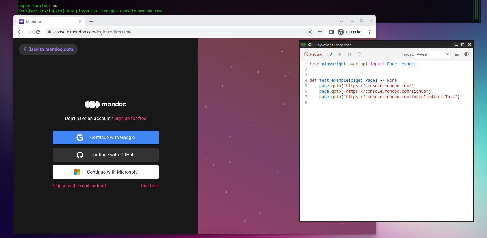

# Simmons: Mondoo Operations Exerciser

An ode to Mr. Richard Simmons and his Sweatin' to the Oldies.  Good ol' Mr. Simmons is going to do some 
automated continious testing for us thanks to PlayWright. 

This repo runs a Github Action on a cron schedule which does the following:

1. Runs local scans of the mondoo/client container (Alpine) against both the US and EU API's
2. Follows this up by login into the console for both the US and EU region to verify the
scan result is present, the vulnerabilities report is available, and then deletes all the assets
in the space.
3. Sends a notification on failure

This repo utilizes the TypeScript Test Runner implementation of PlayWright.

# Getting Started with PlayWright

[Microsoft PlayWright](https://playwright.dev/) is a powerful web testing framework that is:

- Cross-Language: TypeScript, JavaScript, Python, .NET, and Java
- Cross-Browser: Chromium, WebKit, and Firefox
- Cross-Platform: Windows, Linux, Mac, Docker, headless or headed

More importantly, it's easy to get started thanks to it's "codegen" capability.  To get started, install PlayWright
and then invoke codegen against a starting URL.  This will open a browser and an editor.  You can select the language
for the editor and everything you do in the browser will be generated as code into the browser.  Now you can copy 
that code into your favorite editor and customize it (if you even need to) to do whatever you like.

Example (Linux):

```
$ npm init playwright@latest
Need to install the following packages:
  create-playwright@1.17.125
Ok to proceed? (y) y
Getting started with writing end-to-end tests with Playwright:
Initializing project in '.'
✔ Do you want to use TypeScript or JavaScript? · TypeScript
✔ Where to put your end-to-end tests? · tests
✔ Add a GitHub Actions workflow? (y/N) · false
✔ Install Playwright browsers (can be done manually via 'npx playwright install')? (Y/n) · true
✔ Install Playwright operating system dependencies (requires sudo / root - can be done manually via 'sudo npx playwright install-deps')? (y/N) · false
Initializing NPM project (npm init -y)…
....
$ npx playwright codegen console.mondoo.com
```

What you'll see is:



Now click and fill to your hearts content.  Save it and you have your test.

WARNING: If you install all dependancies for the browsers the installation 
requirements are quite significant.  If possible use Headless mode when
automating tests for your CI/CD pipeline.
